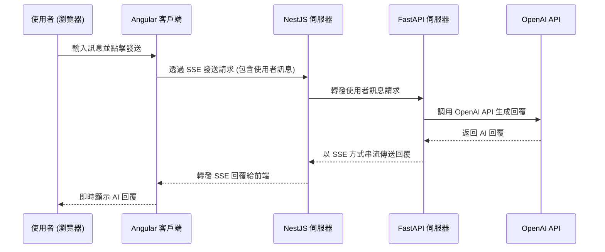

# 專案技術說明與 README

本專案旨在建構一個基於 **Angular**、**NestJS** 和 **FastAPI** 的聊天應用程式，支援持續聊天和串流式訊息傳遞。本文檔將詳細介紹每個伺服器的角色、用途和各自負責的內容，並透過 **Mermaid** 圖表闡述通訊順序和流程。

---

## 目錄

- [專案結構](#專案結構)
- [各組件角色與職責](#各組件角色與職責)
  - [Angular 客戶端](#angular-客戶端)
  - [NestJS 伺服器](#nestjs-伺服器)
  - [FastAPI 伺服器](#fastapi-伺服器)
- [通訊流程](#通訊流程)
  - [總體流程圖](#總體流程圖)
  - [詳細步驟說明](#詳細步驟說明)
- [快速開始](#快速開始)
  - [環境要求](#環境要求)
  - [安裝與執行](#安裝與執行)
- [程式碼結構與說明](#程式碼結構與說明)
  - [Angular 前端](#angular-前端)
  - [NestJS 後端](#nestjs-後端)
  - [FastAPI 服務](#fastapi-服務)
- [常見問題與解決](#常見問題與解決)
- [結論](#結論)

---

## 專案結構

```
project-root/
├── angular-frontend/       # Angular 前端應用
├── nestjs-backend/         # NestJS 後端伺服器
└── fastapi-server/         # FastAPI 服務
```

---

## 各組件角色與職責

### Angular 客戶端

- **角色**：前端使用者介面，提供聊天介面與使用者互動。
- **職責**：
  - 提供訊息輸入框和顯示聊天記錄的介面。
  - 透過 **EventSource** 與 NestJS 伺服器建立 SSE（Server-Sent Events）連線，接收串流式訊息。
  - 處理使用者輸入，將訊息發送到 NestJS 伺服器。

### NestJS 伺服器

- **角色**：中間層伺服器，充當 Angular 客戶端與 FastAPI 伺服器之間的橋樑。
- **職責**：
  - 接收來自 Angular 客戶端的請求，包含使用者的訊息內容。
  - 使用 **Axios** 與 FastAPI 伺服器通訊，將使用者訊息轉發過去。
  - 接收 FastAPI 伺服器的 SSE 回應，解析並透過 SSE 轉發給 Angular 客戶端。
  - 處理錯誤和異常，確保通訊的可靠性。

### FastAPI 伺服器

- **角色**：後端服務，處理實際的聊天邏輯與生成回覆。
- **職責**：
  - 提供 SSE 端點，接收使用者訊息並以串流方式返回 AI 回覆。
  - 使用 **LangChain** 和 **OpenAI API**，生成 AI 回覆內容。
  - 處理訊息的串流傳輸，支援持續聊天功能。

---

## 通訊流程

### 總體流程圖




### 詳細步驟說明

1. **使用者輸入訊息**：使用者在 Angular 客戶端的聊天介面輸入訊息並點擊發送。

2. **Angular 客戶端發送請求**：

   - 使用 `EventSource` 物件，向 NestJS 伺服器的 `/chat` 端點建立 SSE 連線，傳遞使用者訊息作為查詢參數。

3. **NestJS 伺服器處理請求**：

   - 接收到來自 Angular 客戶端的請求。
   - 使用 `Axios` 發送 HTTP GET 請求到 FastAPI 伺服器的 `/chat` 端點，包含使用者的訊息。

4. **FastAPI 伺服器生成回覆**：

   - 接收到 NestJS 的請求後，使用 `LangChain` 和 `OpenAI API` 處理使用者訊息。
   - 以串流方式（SSE）傳送 AI 的回覆，每次傳送一小段內容。

5. **NestJS 伺服器轉發回覆**：

   - 監聽來自 FastAPI 伺服器的 SSE 回應。
   - 解析 SSE 資料，將內容透過 `Subject` 轉發給客戶端。

6. **Angular 客戶端接收回覆**：

   - 透過 `EventSource` 接收來自 NestJS 伺服器的 SSE 訊息。
   - 即時更新聊天介面，顯示 AI 的回覆內容。

7. **使用者看到 AI 回覆**：使用者在聊天介面即時看到 AI 的回覆，實現持續聊天的體驗。

---

## 快速開始

### 環境要求

- **Node.js**：>= 14.x
- **Python**：>= 3.7
- **Angular CLI**：>= 12.x
- **NestJS CLI**：>= 8.x
- **OpenAI API Key**：需要在環境變數中設定 `OPENAI_API_KEY`

### 安裝與執行

#### 1. 複製專案

```bash
git clone https://github.com/yourusername/yourproject.git
cd yourproject
```

#### 2. 安裝並運行 FastAPI 伺服器

```bash
cd fastapi-server
pip install -r requirements.txt
uvicorn fastapi_server:app --reload
```

#### 3. 安裝並運行 NestJS 伺服器

```bash
cd nestjs-backend
npm install
npm run start
```

#### 4. 安裝並運行 Angular 客戶端

```bash
cd angular-frontend
npm install
ng serve
```

#### 5. 訪問應用程式

在瀏覽器中打開 `http://localhost:4200`，即可使用聊天應用程式。

---

## 程式碼結構與說明

### Angular 前端

#### 主要檔案

- `app/chat/chat.component.ts`：聊天組件的邏輯處理。
- `app/chat/chat.component.html`：聊天組件的模板，定義了使用者介面。
- `app/chat/chat.component.css`：聊天組件的樣式表。
- `app/chat/chat.service.ts`：用於與 NestJS 伺服器通訊的服務。

#### 關鍵程式碼解釋

- **ChatComponent**

  - 使用 `EventSource` 與 NestJS 伺服器建立 SSE 連線。
  - 在 `onmessage` 事件中，即時接收並處理 AI 的回覆。
  - 透過 `NgZone.run()` 確保 Angular 的變更檢測機制能夠檢測到資料變化，更新介面。

- **ChatService**

  - 提供 `connect(message: string): EventSource` 方法，建立 SSE 連線。

#### 範例程式碼

```typescript
// chat.component.ts
import { Component, OnInit, OnDestroy, NgZone } from '@angular/core';
import { ChatService } from './chat.service';

interface ChatMessage {
  sender: 'user' | 'ai';
  content: string;
}

@Component({
  selector: 'app-chat',
  templateUrl: './chat.component.html',
  styleUrls: ['./chat.component.css'],
})
export class ChatComponent implements OnInit, OnDestroy {
  messages: ChatMessage[] = [];
  eventSource: EventSource | null = null;
  currentMessage: string = '';
  isStreaming: boolean = false;

  constructor(private chatService: ChatService, private ngZone: NgZone) {}

  // 省略其他程式碼...
}
```

### NestJS 後端

#### 主要檔案

- `src/chat.controller.ts`：處理 `/chat` 端點的控制器。
- `src/app.module.ts`：NestJS 模組配置。

#### 關鍵程式碼解釋

- **ChatController**

  - 使用 `@Sse()` 裝飾器建立 SSE 端點。
  - 使用 `Axios` 發起請求到 FastAPI 伺服器的 `/chat` 端點。
  - 監聽來自 FastAPI 的 SSE 回應，解析並透過 `Subject` 轉發給客戶端。

#### 範例程式碼

```typescript
// chat.controller.ts
import { Controller, Get, Query, Sse } from '@nestjs/common';
import { Observable, Subject } from 'rxjs';
import axios from 'axios';

@Controller('chat')
export class ChatController {
  @Get()
  @Sse()
  async chat(@Query('message') message: string): Promise<Observable<MessageEvent>> {
    const subject = new Subject<MessageEvent>();

    // 省略其他程式碼...

    return subject.asObservable();
  }
}
```

### FastAPI 服務

#### 主要檔案

- `fastapi_server.py`：FastAPI 伺服器的主檔案。

#### 關鍵程式碼解釋

- **`/chat` 端點**

  - 接收使用者訊息，透過 `LangChain` 和 `OpenAI API` 生成回覆。
  - 使用非同步生成器和 `StreamingResponse`，以 SSE 方式串流傳送回覆。

#### 範例程式碼

```python
# fastapi_server.py
from fastapi import FastAPI, Request
from fastapi.responses import StreamingResponse
from langchain.chat_models import ChatOpenAI
from langchain.prompts import ChatPromptTemplate
from langchain.schema import StrOutputParser
import asyncio
import json

app = FastAPI()

# 省略其他程式碼...

@app.get("/chat")
async def chat(request: Request):
    async def generate():
        # 省略其他程式碼...
        async for chunk in chat_chain.astream({"message": message}):
            yield f"data: {json.dumps({'type': 'chunk', 'content': chunk})}\n\n"
        yield f"data: {json.dumps({'type': 'end'})}\n\n"

    return StreamingResponse(generate(), media_type="text/event-stream")
```

---

## 常見問題與解決

1. **Angular 介面未更新訊息**

   - **原因**：可能是因為 `EventSource` 的回調函數在 Angular 的 Zone 外執行，導致變更檢測機制無法檢測到資料變化。
   - **解決方法**：在回調函數中使用 `NgZone.run()`，確保在 Angular Zone 內更新資料。

2. **CORS 跨域問題**

   - **原因**：瀏覽器出於安全考量，阻止了跨域請求。
   - **解決方法**：
     - 在 FastAPI 伺服器中添加 `CORSMiddleware`，允許來自所有來源的請求。
     - 在 NestJS 伺服器中啟用 CORS。
     - 在 Angular 開發伺服器中，使用代理配置或啟動時添加 `--proxy-config` 參數。

3. **SSE 連線中斷**

   - **原因**：可能是伺服器未正確處理 SSE 連線，或者網路不穩定。
   - **解決方法**：檢查伺服器程式碼，確保正確處理 SSE；在前端添加錯誤處理和重連機制。

---

## 結論

本專案透過結合 **Angular**、**NestJS** 和 **FastAPI**，實現了一個支援持續聊天和串流式訊息傳遞的應用程式。各組件各司其職，Angular 提供使用者介面，NestJS 作為中間層處理通訊，FastAPI 負責核心的聊天邏輯。

透過本文檔的詳細說明，希望能夠幫助後續開發人員快速理解專案結構、各組件的角色和職責，以及通訊流程。